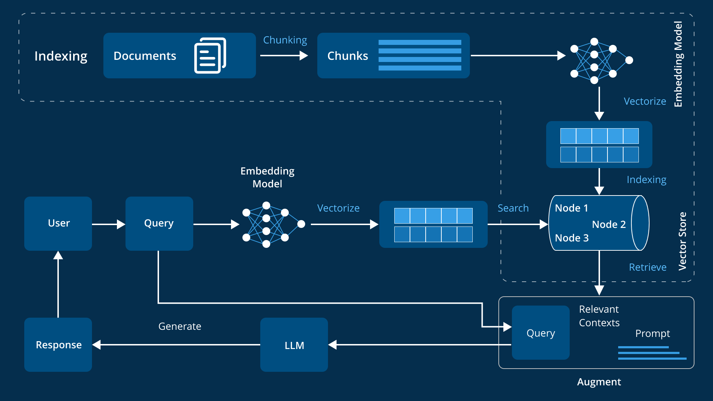

# Nameste !
### Virtual Teaching Asistant for Tools in Data Science course
A **RAG** model as my college project in Tools in DataScience project .

* RAG stands for Retrieval-Augmented Generation.It is a technique in natural language processing (NLP) that combines:
    * **Retrieval :** Fetching relevant documents or information from a knowledge base or database.
    * **Augmented :** Enhancing or supplementing the input to improve the model’s output.
    * **Generation :** Using a language model to generate answers based on both the input query and the retrieved documents.


#### DATA SOURCE : 
- Course Specific Data :  
    - [Course content](https://tds.s-anand.net/#/2025-01/) with content for TDS Jan 2025 as on 15 Apr 2025.
- Discourse Posts :
    - [TDS Discourse posts](https://discourse.onlinedegree.iitm.ac.in/c/courses/tds-kb/34) with content from 1 Jan 2025 - 14 Apr 2025.

#### WORK FLOW : ( Taken from Internet)



#### DATA SCRAPPING : 
- For Discourse Post data :
    - I have used discourse public apis for extracting json formated post data from our discourse portal.
    Example API - 
        > https://discourse.onlinedegree.iitm.ac.in/c/courses/tds-kb/34.json

- For Course content data : 
    - I cloned `Markdown` files of ours professor's public [github repo on Tools in Data Science portal](https://github.com/sanand0/tools-in-data-science-public).
    Example Clone - 
        ```cmd
        git clone https://github.com/sanand0/tools-in-data-science-public
        ```
 
#### IMPORTANT INSTRUCTION :
- For posts data scrapping run python code in sequence to get the final `.json` file of posts data for embedding and storing.
    ```
    extract_all_topics_to_files.py --> assemble_all_topic.py --> assemble_all_topic_from_jan_april.py --> extract_all_posts.py --> get_image_description.py

    ```
- For course data to get final `.json` file do this.
    ```
    clone public github repo on Tools in Data Science portal --> run extract_course_data.py

- Change `ENVIRONMENT_VARIABLE` according to you.

