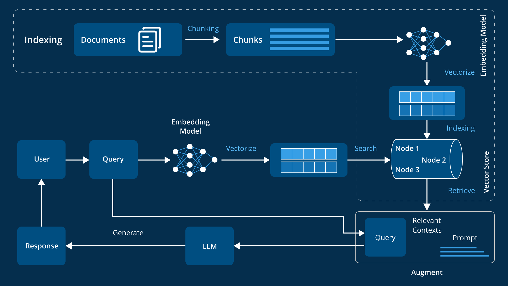

# Nameste !
### Virtual Teaching Asistant for Tools in Data Science course
A **RAG** model as my college project in Tools in DataScience project .

* RAG stands for Retrieval-Augmented Generation.It is a technique in natural language processing (NLP) that combines:
    * **Retrieval :** Fetching relevant documents or information from a knowledge base or database.
    * **Augmented :** Enhancing or supplementing the input to improve the model’s output.
    * **Generation :** Using a language model to generate answers based on both the input query and the retrieved documents.

#### DATA SOURCE : 
- Course Specific Data :  
    - [Course content](https://tds.s-anand.net/#/2025-01/) with content for TDS Jan 2025 as on 15 Apr 2025.
- Discourse Posts :
    - [TDS Discourse posts](https://discourse.onlinedegree.iitm.ac.in/c/courses/tds-kb/34) with content from 1 Jan 2025 - 14 Apr 2025.

#### WORK FLOW : ( Taken from Internet)

